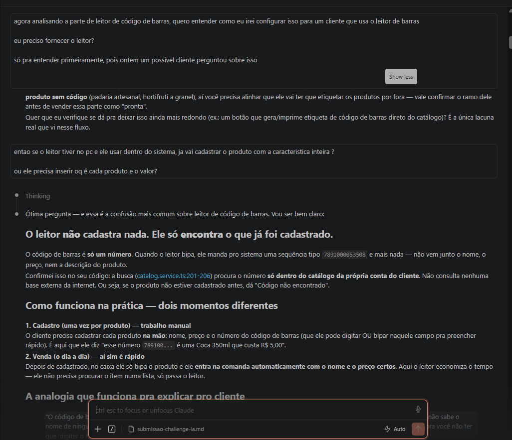
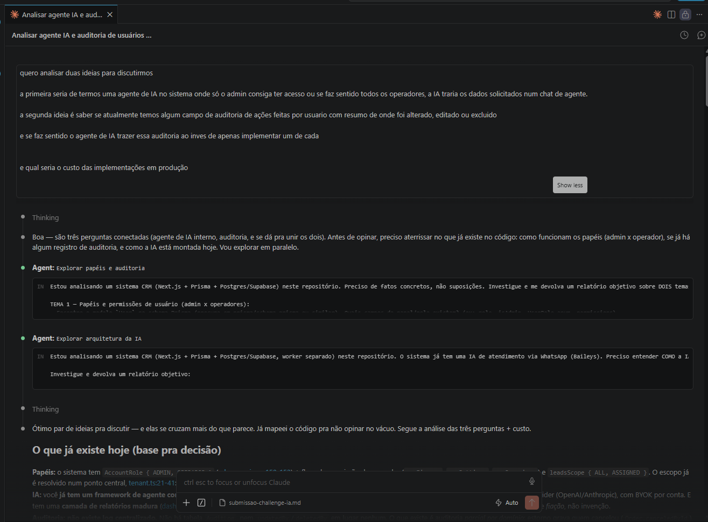
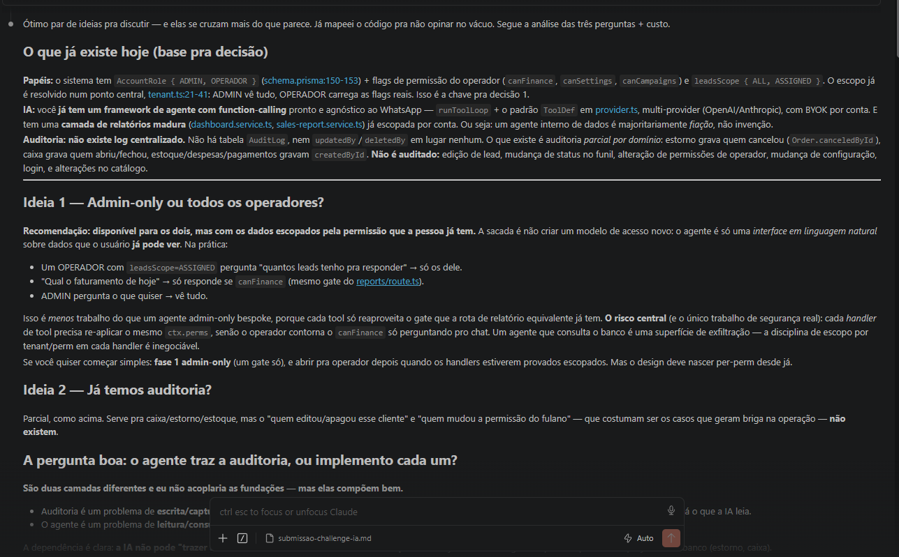
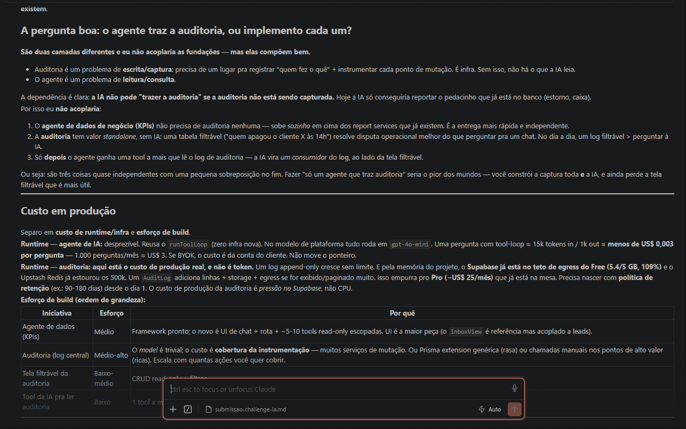
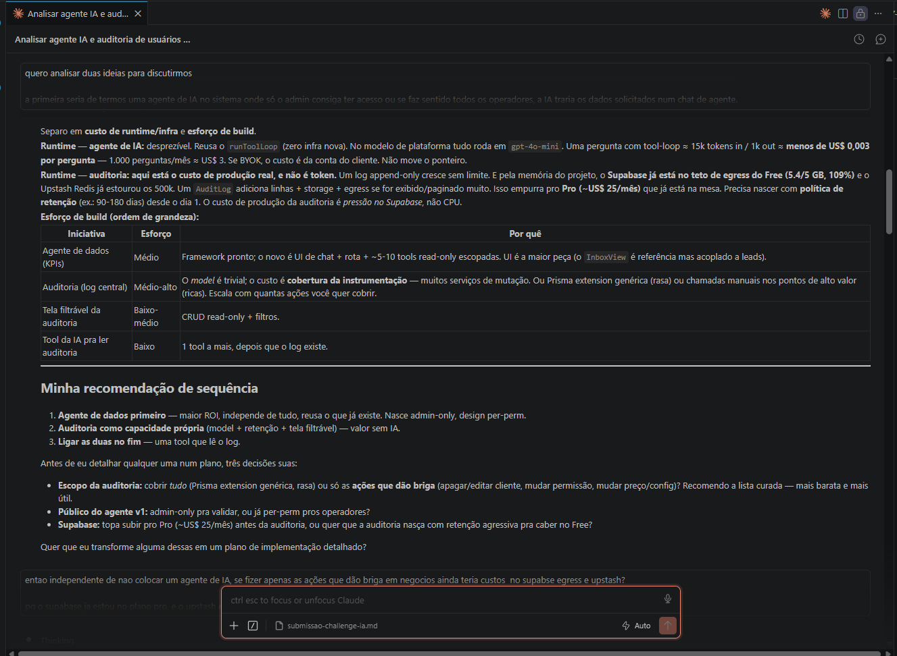
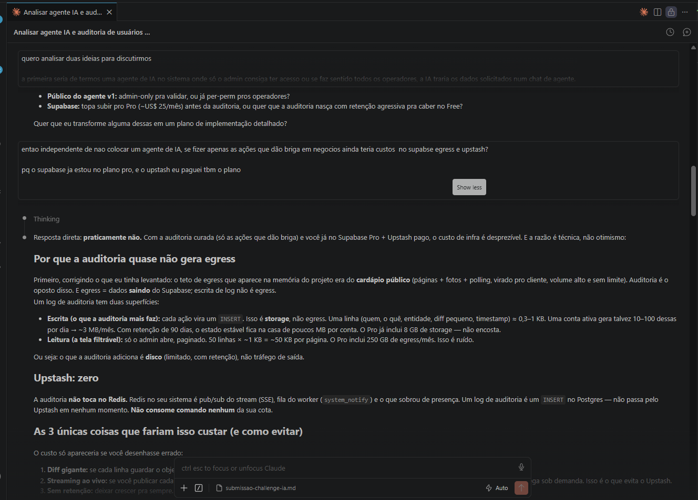

# Submissão — Matheus de Morais Braga — Challenge de Vaga de IA

> O sistema abaixo começou como o desafio técnico de uma vaga de IA (um CRM de
> prospecção conversacional que qualifica leads por WhatsApp) e **cresceu por iniciativa
> própria** num produto de gestão mais amplo: vendas (PDV + online), controle de estoque,
> gateway de pagamento PIX, agenda de profissionais e atendimento conversacional
> genérico para qualquer negócio. O núcleo de IA é o que o challenge pedia; o restante é
> o que escolhi construir para mostrar amplitude.

---

## Sobre mim

- **Nome:** Matheus de Morais Braga
- **LinkedIn:** https://www.linkedin.com/in/matheus-morais-7a4629289/
- **Challenge escolhido:** Vaga de IA — CRM de prospecção conversacional com qualificação automática de leads via WhatsApp.

---

## Executive Summary

Construí um **CRM de prospecção conversacional com IA** (Next.js 15 full-stack) que
importa uma lista de leads, dispara mensagens no WhatsApp, **qualifica cada conversa
automaticamente** e move o lead num pipeline comercial — agendando reunião ou enviando
oferta quando o lead esquenta. O núcleo diferencial é tratar a IA como **proponente, não
decisora**: um agente gpt-4o propõe score + próxima ação via *function calling* forçado,
mas quem **decide** o status do lead é uma **state machine pura e testável** — os limiares
de negócio (qualifica em ≥70, descarta em <40 com desinteresse explícito) vivem em código,
não no prompt. Encontrei que a combinação de *saída estruturada* (espelho duplo zod ↔ JSON
Schema) + *tiering de modelos* (gpt-4o-mini p/ classificação, gpt-4o p/ decisão) entrega
qualificação confiável a custo controlado, validada por **evals comportamentais por faixa**.
A principal recomendação é **produzir o agente com guardrails determinísticos** (state
machine + schema validado em runtime) antes de escalar o volume de disparos, e não o
contrário — é onde o sistema ganha auditabilidade e a IA para de ser caixa-preta.

---

## Solução

Um MVP funcional que roda **100% local** (WhatsApp e Google Calendar têm modo *mock*; a
única credencial obrigatória é a `OPENAI_API_KEY` — a IA é o núcleo e é sempre real).
Fluxo end-to-end:

1. **Importar leads** — CSV com nome + telefone (normalização E.164, dedupe, duplicados ignorados).
2. **Criar e iniciar campanha** — template com `{{nome}}`; o `startCampaign` **enfileira** um
   job por lead (não envia em loop) e um **worker** separado consome a fila com rate-limit,
   jitter, janela comercial e cap diário (warm-up).
3. **Conversar como o lead** — a IA lê a conversa, **qualifica** (score sobe), responde a
   próxima pergunta e move o status.
4. **Agendar / ofertar / descartar** — ao qualificar, a IA propõe horários no chat; o lead
   escolhe → evento criado (mock/Google). Intenção de compra clara → envia oferta (Pix).
   Desinteresse explícito → descarta.

O pipeline: `NOVO → CONTATADO → EM_CONVERSA → QUALIFICADO → REUNIAO_AGENDADA → PAGO`
(ou `DESCARTADO`), com rótulos renomeados por ramo (imobiliária, veículos, serviços
consultivos) aplicados no onboarding.

### A peça central: IA como proponente, state machine como decisora

Cada mensagem inbound passa pela orquestração em
[`conversation.service.ts`](../src/server/services/conversation.service.ts):

1. **Dedupe** por `providerMessageId` → salva `Message(INBOUND)`.
2. Lead `NOVO`/`CONTATADO` → `EM_CONVERSA`.
3. Se há reunião proposta, a IA (gpt-4o-mini) **interpreta a escolha de horário** e agenda.
4. Senão: **agente de qualificação** (gpt-4o, JSON estruturado via function calling) →
   `Qualification` + score + `scoreJustification` (texto que explica o score — XAI).
5. **Regras de pipeline** ([`pipeline.ts`](../src/server/services/pipeline.ts), função
   pura): decidem o próximo status a partir de `(status atual, score, nextAction)`.

```ts
// pipeline.ts — a decisão de negócio é código testável, não prompt
export const SCORE_QUALIFY = 70;
export const SCORE_DISCARD = 40;

export function decidePipeline(input: {
  current: LeadStatus; score: number; nextAction: NextAction;
}): PipelineDecision {
  if (TERMINAL.includes(current)) return { /* não reage mais */ };
  if (nextAction === "send_offer")   return { status: "OFERTA_ENVIADA", shouldOffer: true };
  if (score >= SCORE_QUALIFY || nextAction === "schedule_meeting")
    return { status: "QUALIFICADO", shouldSchedule: true };
  if (score < SCORE_DISCARD && nextAction === "discard")
    return { status: "DESCARTADO", shouldDiscard: true };
  return { status: "EM_CONVERSA", shouldReply: true };
}
```

**Saída estruturada confiável.** A qualificação e a escolha de horário usam
*function calling forçado* (`tool_choice`) — o modelo só pode responder chamando a tool,
no formato certo. O contrato é mantido em **dois espelhos** em
[`schemas.ts`](../src/server/ai/schemas.ts): o JSON Schema (vai na tool, restringe a
geração) e o zod (valida em runtime o que voltou). Um **teste de consistência** garante que
os dois não derivem.

---

## Abordagem

Ataquei o problema decomponto-o em **camadas com níveis de certeza diferentes** e
priorizando o que era mais arriscado de errar — a **decisão de negócio** — antes do que era
trivialmente reversível (UI, integrações).

1. **Regra de negócio primeiro, e determinística.** Em vez de pedir para a IA "decidir o
   status do lead" no prompt (frágil, não-testável, não-auditável), extraí a decisão para uma
   **função pura** (`decidePipeline`). A IA só propõe `(score, nextAction)`; a transição de
   estado é código com limiares explícitos e 100% coberto por testes unitários. Comecei por
   aqui porque é a parte onde um bug silencioso custa mais caro (lead quente descartado,
   lead frio incomodado).
2. **Contrato da IA em dois espelhos.** Para eliminar alucinação de formato, forcei
   *function calling* e validei a saída em runtime com zod — mantendo os dois schemas em
   paralelo com um teste que impede *drift*. Anti-alucinação de conteúdo também entrou no
   próprio schema (ex.: o campo `email` carrega `"Nunca invente."` no description).
3. **Tiering de modelos por custo/responsabilidade.** `gpt-4o-mini` para classificação
   barata e próxima pergunta; `gpt-4o` só para a qualificação estruturada e decisões. Isso
   responde ao requisito de custo sem sacrificar a decisão crítica.
4. **Evals que respeitam o não-determinismo.** Como LLM não é determinístico, os evals dos
   agentes (`agents.eval.test.ts`) assertam por **faixa/comportamento**, não valor exato:
   lead quente não é descartado e pontua alto; lead que pede para parar vira `discard`; lead
   novo continua em qualificação; e-mail é capturado quando dado e **nunca inventado**;
   interpretação de horário acerta número, descrição e recusa ambíguos. São **opt-in**
   (`RUN_AI_EVALS=1`) para que o `npm test` padrão fique verde, determinístico e sem custo.
5. **Integrações como interfaces, não acoplamento.** WhatsApp e Calendar são *interfaces*
   resolvidas por factory (`WHATSAPP_MODE`/`CALENDAR_MODE`). Trocar mock → real é **uma env
   var, zero mudança de código de domínio** — priorizei isso para não bloquear a entrega na
   burocracia da Meta/Google e ainda manter o caminho de produção desenhado.
6. **Deliverability como problema de primeira classe.** O disparo de campanha é
   **assíncrono**: `OutboundJob` por lead numa fila Postgres, consumida por um worker
   persistente com intervalo mínimo + jitter, janela comercial e cap diário (warm-up). É a
   diferença entre "envia 1.000 mensagens e derruba o número" e "sobe devagar sem cair".

**O que priorizei e por quê:** correção da decisão (state machine + schema) e observabilidade
da IA (score + justificativa textual) acima de UI polida — porque o desafio é de IA, e a
parte que precisa ser confiável é o raciocínio do agente, não o visual.

---

## Resultados / Findings

### O que foi construído (métricas do repositório)

| Métrica | Valor |
|---|---|
| Commits | **786** (17/jun → 16/jul/2026, ~1 mês) |
| Arquivos de teste | **146** (`*.test.ts`) |
| Arquivos no módulo de IA (`src/server/ai/`) | 27 (agents, schemas, provider, tools, prompts, evals) |
| Stack | Next.js 15 (App Router) · React 19 · Prisma 6 · Postgres · OpenAI · Zod · Vitest · Baileys |

### O que os testes mostram

- **Suíte determinística** (`npm test`): cobre as funções puras de cada camada — state
  machine de pipeline, validação das saídas da IA + **espelho zod ↔ JSON Schema**,
  formatação de transcript, opt-out, pacing/cap/reaper do worker, seleção de chip e sinais
  de ban do Baileys. Sem rede, sem custo.
- **Evals de IA** (`RUN_AI_EVALS=1`): validam comportamento por faixa. Achado relevante: a
  anti-alucinação de e-mail **funciona** — captura quando o lead informa e retorna `null`
  quando não menciona, sem inventar. A interpretação de horário acerta escolha por número,
  por descrição e recusa ambíguos ("qualquer um tá bom" → `confident: false`).

### Decisões de arquitetura que se provaram

- **State machine pura × prompt.** Mover os limiares para código testável tornou as
  transições auditáveis e imunes a "o modelo mudou de ideia". O `scoreJustification` dá
  explicabilidade (XAI) sem abrir mão da determinismo da decisão.
- **Tiering de modelos.** Manter `gpt-4o-mini` no caminho quente (classificação + próxima
  pergunta) e `gpt-4o` só na decisão estruturada mantém o custo por lead qualificado baixo.
- **Mock ↔ real via factory.** Nenhum código de domínio mudou entre os modos; o caminho de
  produção (Cloud API / Google Calendar) está desenhado, não improvisado.

### Caminho de produção desenhado (não só MVP)

- Filas & assíncrono (trocar Postgres queue por BullMQ+Redis quando o volume justificar).
- Rate limit por número, retry com backoff + DLQ, idempotência por `providerMessageId`.
- Observabilidade: logs estruturados, métricas de funil e **custo por lead qualificado**
  (tokens × preço por tier).
- LGPD: opt-out automático já implementado ("PARAR/SAIR/STOP" → `DESCARTADO` + jobs
  cancelados); falta registrar base de consentimento e retenção/anonimização.
- Caminho B (Baileys multi-número) como fallback selecionável por env quando a Cloud API
  não cabe — reusa integralmente a fila, o worker e o opt-out.

---

## Recomendações

Priorizadas por impacto × esforço:

1. **Produzir com guardrails antes de escalar volume.** A state machine + schema validado
   em runtime já são o guardrail. Antes de subir o cap diário, adicionar **métrica de custo
   por lead qualificado** (tokens × preço) e **taxa de conversão por etapa do funil** — é o
   número que justifica (ou não) o disparo em escala.
2. **Human handoff explícito.** Já existe a tool `escalar_humano` (avaliada: reclamação
   séria e pedido por atendente disparam corretamente). Recomendo sinalizar **alto ticket**
   e objeções complexas para parar a IA e passar a conversa — evita que a IA tente fechar
   sozinha negócios onde errar custa caro.
3. **Migrations versionadas (com cuidado).** O cutover de `db push` → `prisma migrate` foi
   **revertido** em produção porque o baseline não batia com o schema real (teria marcado o
   baseline como aplicado sem criar colunas pendentes, derrubando o login). Recomendação:
   sincronizar prod com `db push` primeiro, **só então** `migrate resolve --applied`, e a
   partir daí versionar por migration em PR.
4. **Caching de prompt + batching de classificações.** Próxima alavanca de custo depois do
   tiering — agrupar leads em batch para a classificação barata e cachear o prompt
   estático da qualificação.
5. **LGPD: consentimento e retenção.** O opt-out já existe; registrar `consentSource` e a
   política de retenção/anonimização antes de ir a volume real de outbound.

---

## Limitações

- **Sem volume real de outbound.** Toda a camada de deliverability (worker, rate-limit,
  warm-up, qualidade do número) foi implementada e testada em unidade, mas **não validada
  em campanha real de ~1.000/dia** — o comportamento da Meta (quality rating, 429) só se
  confirma em produção. O caminho Baileys exige um chip real (smoke manual).
- **Evals são opt-in e chamam a OpenAI.** Não rodam no CI padrão (sem custo); rodam sob
  demanda. Não há regressão contínua automática da qualidade do agente — seria o próximo
  passo (eval gate no CI com um orçamento fixo).
- **Custo não instrumentado.** O tiering está implementado, mas a métrica de
  tokens/custo por lead qualificado ainda **não é coletada** em runtime — é uma
  recomendação, não um finding medido.
- **Migrations ainda em `db push`.** Por causa do cutover revertido (acima), o deploy do
  worker ainda usa `db push` em vez de migrations versionadas — funciona, mas não é o ideal
  de governança de schema.
- **Não testado com provedor de LLM alternativo.** Toda a avaliação foi com OpenAI
  (gpt-4o / gpt-4o-mini); o `AiClient` é uma interface, mas o fallback de modelo real não
  foi exercitado.
- **Walk-in sem lead.** Os passes de automação de agenda filtram `leadId != null`; agendar
  para um cliente sem lead cadastrado exige outro caminho de envio (fora de escopo v1).

---

## Process Log — Como usei IA

> Este bloco é obrigatório. Sem ele, a submissão é desqualificada.

### Ferramentas usadas

| Ferramenta | Para que usou |
|---|---|
| Claude Code (Opus 4.6, no VSCode) | Ferramenta **única** de todo o ciclo: análise exploratória, arquitetura, implementação de features, debug, escrita de testes (inclusive os evals de IA), refatoração e documentação. Não usei outro assistente de IA — todo o código e o raciocínio passaram por aqui. |

> **Evolução do modelo:** o Opus 4.6 foi a versão usada no VSCode ao longo do projeto.
> (Se a vaga pedir a versão exata do cliente/extensão, ajuste aqui — mas a ferramenta é
> somente Claude Code.)

### Workflow

Descrevo passo a passo onde a IA entrou em cada etapa:

1. **Decomposição & arquitetura.** Comecei pedindo à IA que mapeasse o problema
   (prospecção → qualificação → agendamento) e propusesse a separação de camadas. A IA
   sugeriu a estrutura services/ai/whatsapp/calendar; **eu refinei** para isolar a decisão
   de pipeline numa função pura (não confiar a transição de estado ao prompt).
2. **State machine + schemas.** IA escreveu o esqueleto de `pipeline.ts` e os dois espelhos
   (zod + JSON Schema); **eu exigi** o teste de consistência entre os dois e inseri os
   textos anti-alucinação ("Nunca invente.") direto no `description` dos campos.
3. **Tiering & evals.** IA propôs o tiering gpt-4o-mini/gpt-4o; **eu desenhei** os evals por
   faixa (assertar comportamento, não número exato) e o gate opt-in para manter o `npm test`
   determinístico e sem custo.
4. **Deliverability.** IA implementou o worker (fila `OutboundJob`, pacing, cap, janela,
  reaper); **eu adicionei** o gate de qualidade (webhook da Meta pausa campanhas
  `RUNNING` em RED/YELLOW) e o caminho Baileys como fallback selecionável por env.
5. **Debug & correção.** A cada bug, IA localizava a causa e propunha o fix; **eu validava**
   contra o comportamento esperado e frequentemente encontrava casos que a IA não cobriu
   (ver seção abaixo).
6. **Refatoração & docs.** IA gerou o README e os planos de implementação; **eu revisei**
   acurácia técnica e alinhei à "Proposta de Valor" do challenge.

### Onde a IA errou e como corrigi

> Estes são exemplos reais extraídos do **git history** do repositório — cada um ancorado
> num commit `fix(...)` com a causa-raiz documentada no corpo (rodar `git show <hash>`).
> São os momentos em que parear com IA exige supervisão técnica.

1. **Cutover de migration que derrubaria o login em produção.** A IA aplicou
   `prisma migrate deploy` com um baseline que não refletia o schema real de produção. O
   `migrate resolve --applied` marcaria o baseline como aplicado **sem criar** colunas de
   permissão pendentes, o que derrubaria o login. **Corrigi revertendo** para `db push` e
   documentei o caminho seguro (sincronizar prod primeiro, só então resolver o baseline).
   *Lição: a IA otimiza pelo caminho "correto" do ponto de vista do schema, mas não enxerga
   o drift entre o baseline e a produção real.* (ver README → "Migrations versionadas")
2. **Resposta do operador virava "recebida do lead"** (`0e598f3`). A caixa de demonstração
   "responder como o lead" vazava para produção sempre que a IA não estava pausada: o texto
   do operador era injetado como INBOUND e não ia ao cliente. A IA não percebeu o vazamento
   de rota de dev para prod. **Corrigi** travando a rota em 403 fora do modo mock e unify os
   3 botões "Assumir" num helper `assumeAndHold`.
3. **Cache negativo envenenado** (`c2ab4b5`). Quando o provedor de EAN (DotCompany) falhava
   em runtime (rede/timeout), a IA tratava "skip" e "error" como iguais e gravava cache
   negativo de 30 dias a partir de um "miss" do outro provedor (Cosmos, que só conhece
   alimento) — travando um não-alimento por 30 dias só porque a cota acabou. **Corrigi**
   distinguindo skip (inaplicável) de error (runtime): só cacheio negativo se alguém
   confirmou miss E ninguém falhou em runtime. +1 teste de regressão.
4. **Race condition ao sugerir nome por EAN** (`bb28160`). Se o usuário digitava no campo
   Nome durante a busca do EAN, a checagem `!name.trim()` pós-await usava o valor velho do
   closure e sobrescrevia o digitado. Clássico stale-closure que a IA não flagou. **Corrigi**
   com `setState` funcional, que lê o valor atual no commit.
5. **IA respondia chip↔chip** (`4c3a732`). O `providerMessageId` do WhatsApp é o mesmo para
   remetente e destinatário. Como unique **global**, quando dois números conectados
   conversavam, o `ingestInbound` do destinatário colidia (P2002) com a cópia outbound do
   remetente e abortava antes de responder — a IA nunca respondia. Bug que só apareceu com
   2 chips reais. **Corrigi** com unique composto `@@unique([leadId, providerMessageId])` +
   migration idempotente + teste de regressão.
6. **Resposta da IA travando ~10 minutos** (`9b5e71e`). Os SDKs OpenAI/Anthropic eram
   construídos sem `timeout`/`maxRetries`, herdando o default (~10min). Uma chamada
   pendurada segurava a conversa inteira, já que a resposta reativa faz várias chamadas em
   série. Origem de gaps de ~13min em prod. **Corrigi** com `AI_REQUEST_TIMEOUT_MS`
   (default 45s) e `AI_MAX_RETRIES`, configuráveis por env.
7. **IA ignorava o horário que o lead pedia** (`29a5094`). `proposeAppointmentSlots`
   oferecia sempre os 3 slots mais cedo a partir de agora — "semana que vem" virava hoje de
   manhã; "amanhã 14h" repetia os mesmos 3 em loop. A IA não repassava a preferência do lead
   para a busca. **Corrigi** fazendo a tool `agendar` receber `preferredStartIso` (a IA
   calcula da data atual em contexto) e o interpretador distinguir "escolheu 1/2/3" de
   "quero outro horário", re-propondo em volta da preferência.
8. **EPERM no rename da DLL do query-engine.** Ao rodar `prisma generate`/`db push` com o
   `next dev` no ar, a IA não previa o lock de arquivo (EPERM no Windows). **Corrigi**
   adicionando a regra operacional "pare o `next dev` antes de qualquer prisma generate"
   (memória do projeto, refletida em todos os planos TDD em `docs/plans/`).

**Padrão recorrente que percebi:** a IA tende a assumir contratos de API felizes (campos
no formato esperado, cache só de sucesso, unique global, default de SDK, migrações
lineares) e subestima casos de falha e drift de ambiente. Os erros mais sutis são sempre
de **fronteira de sistema** (dev vs prod, skip vs error, stale closure, semântica de
"preferência"). A correção foi quase sempre **adicionar guards de falha**, **testar o
caminho de erro** e anexar um **teste de regressão** ao fix.

### O que eu adicionei que a IA sozinha não faria

A IA é excelente em **otimizar o que existe**; ela **não decide, sozinha, expandir o
escopo de um produto nem priorizar quais capacidades de negócio faltam.** Esse é o
julgamento que fiz questão de aportar — transformar um "teste de vaga de IA" num sistema de
gestão que resolve ponta-a-ponta o dia de um negócio. O núcleo de IA é o que o challenge
pedia; tudo abaixo é **visão de produto** minha, que a IA não teria proposto por conta
própria:

1. **Painel de resumo com cards que diferenciam tempo de resposta da IA × humano.** A IA
   atender rápido não é métrica se não houver comparativo. Construí um dashboard
   ([`dashboard.service.ts`](../src/server/services/dashboard.service.ts) +
   [`DashboardView.tsx`](../src/components/DashboardView.tsx)) que pareia cada resposta da
   IA ao primeiro inbound ainda aberto da conversa e calcula a latência média **separada**
   da 1ª resposta do atendente humano (handoff) — dois `StatCard`s lado a lado. A IA teria
   gerado "tempo de resposta médio" sem distinguir os dois agentes, o que esconde exatamente
   o valor (a IA responde em segundos; o humano, em minutos).
2. **Estoque controlado automaticamente ao fechar a venda (presencial e online).** A IA
   atende e abre comanda, mas **não fecha nem cobra** (isso é deliberado — não se dá a uma
   LLM a alavanca de movimentar dinheiro/estoque sozinha). O fechamento decrementa o
   estoque atomicamente na mesma transação
   ([`stock.service.ts`](../src/server/services/stock.service.ts) ·
   `applyOrderStockExit` em `closeOrder` e no `advanceOnlineOrder` do delivery), com
   reversão idempotente em estorno. A IA não teria modelado a separação "consultar/abrir"
   × "fechar/cobrar" — é uma decisão de **confiança e controle** que vem do entendimento de
   que IA propõe, humano (ou transação determinística) consolida.
3. **Gateway de pagamento PIX multi-provedor.** Em vez de amarrar a um provedor, modelei
   uma interface `PaymentGateway` (`createPixCharge`/`isChargePaid`/`parseWebhookChargeId`)
   com implementações para PagBank, Asaas e Mercado Pago
   ([`src/server/payments/`](../src/server/payments)), reconciliação por webhook e cobrança
   via oferta conversacional. A IA tenderia a colar o SDK de um provedor; eu generalizei
   porque a escolha de adquirente é uma decisão de negócio, não técnica.
4. **Agenda de profissionais com engine de disponibilidade pura + booking por chat.** Um
   motor de slots sem I/O ([`availability.ts`](../src/lib/agenda/availability.ts): janelas
   de trabalho, fuso, sobreposição) alimentando o agendamento de profissionais
   ([`appointment.service.ts`](../src/server/services/appointment.service.ts) com lock
   anti-double-booking) e um subfluxo onde a **IA propõe horários reais da agenda** pelo
   WhatsApp e interpreta a escolha do lead ([`scheduling.service.ts`](../src/server/services/scheduling.service.ts)).
   A IA não teria, sozinha, separado a matemática de disponibilidade (testável) da cola de
   DB nem adicionado o lock de concorrência.
5. **Atendimento conversacional genérico para qualquer negócio (não só prospecção).** O
   challenge pedia qualificação de leads; eu generalizei o agente para atender qualquer
   vertical — com `tools` de catálogo/estoque/comanda/agendamento
   ([`attendance-tools.ts`](../src/server/ai/tools/attendance-tools.ts)), templates de ramo
   e onboarding verticalizado. Isso transforma o CRM de "ferramenta de SDR" em "atendente
   que serve um salão, uma imobiliária ou uma lanchonete" — um reposicionamento de produto
   que dependia de entender o usuário final, não de completar um prompt.

**Padrão:** em todos os casos a divisão é a mesma — **a IA propõe/consulta/gera; a
transação determinística (state machine, fechamento de venda, lock de agenda) consolida.**
Esse é o princípio de design que aporta *confiança* e *auditabilidade*, e nenhum deles a IA
teria estabelecido sozinha a partir do enunciado do challenge.

> Guardrails técnicos que também são julgamento meu (não viriam da IA por padrão): a
> separação "IA propõe, state machine decide"; o espelho duplo zod ↔ JSON Schema com teste
> de consistência; evals por faixa com gate opt-in; e automações de lifecycle que sobem
> **inertes** (default-off + kill-switch) — porque em outbound, "ligar por engano" manda
> mensagem errada para milhares de pessoas.

### Evidências

- [x] **Git history** — 786 commits (17/jun → 16/jul/2026), sendo **471 com
      `Co-Authored-By`** atribuindo autoria à IA (~60%). **Evidência principal do
      processo:** mostra a evolução incremental e os fixes de erros da IA (seção acima é
      toda ancorada em commits reais com hash). Para conferir:
      ```bash
      git log --oneline | wc -l                              # 786
      git log --grep="Co-Authored-By" --oneline | wc -l      # 471
      git show 0e598f3                                       # exemplo de fix com causa-raiz
      ```
- [x] **Planos TDD** — 61 planos em [`docs/plans/`](../docs/plans/) escritos **antes** do
      código (decomposição + testes que falham → implementação). São o rastro da
      decomposição do problema que precede o prompt.
- [x] **Evals de agentes** — [`src/server/ai/agents.eval.test.ts`](../src/server/ai/agents.eval.test.ts)
      chamam a IA de verdade (opt-in, `RUN_AI_EVALS=1`) e assertam comportamento por faixa.
      É IA avaliando IA — o instrumento de feedback que diz se um prompt/modelo regrediu.
- [x] **Screenshots das conversas com IA** *Para chegar às decisões de arquitetura e infraestrutura descritas, utilizei sessões de pair-programming com IA para validar custos, riscos e fluxos de negócio em tempo real.

## Processo Iterativo e Tomada de Decisão (Vibe Coding)

Para chegar às decisões de arquitetura e infraestrutura descritas, utilizei sessões de pair-programming com IA para validar custos, riscos e fluxos de negócio em tempo real.









Agradeço a atenção!

